# GrubvoxAndroid 

The Grubvox color scheme for Android is inspired by the colors from
[gruvbox](https://github.com/morhetz/gruvbox).

| Gruvbox Dark Mode | Grubvox Light Mode |
| ----------------- | ------------------ |
| 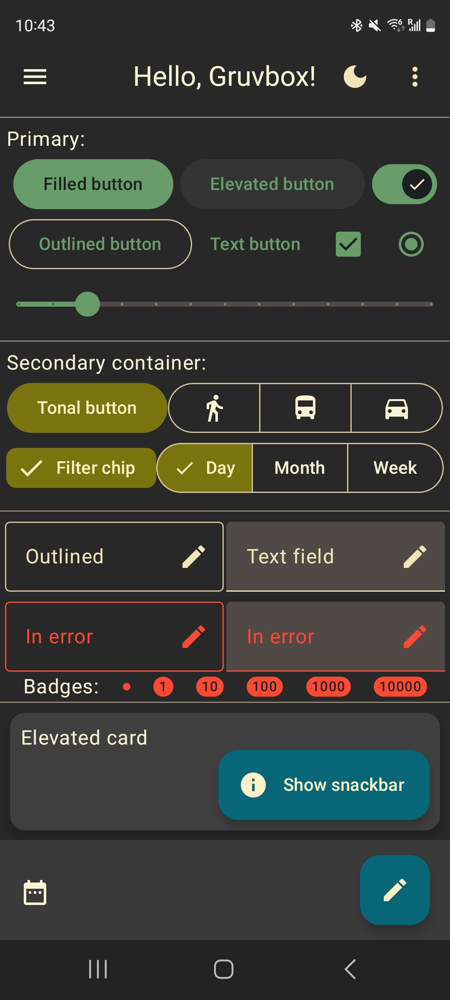 | 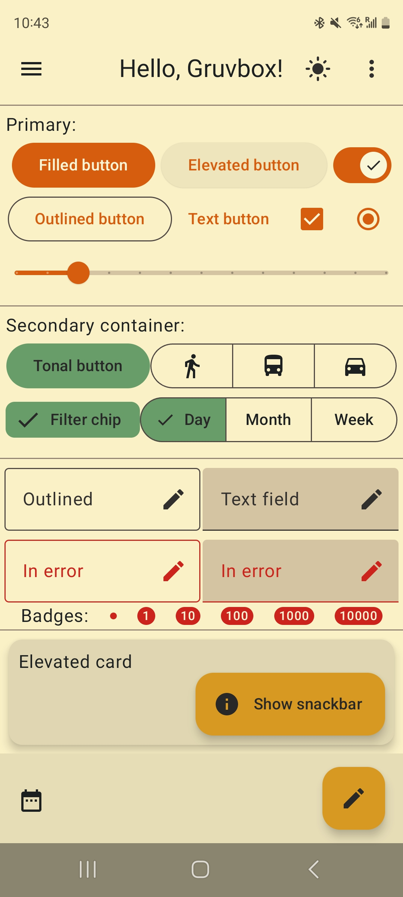 |

## Color Mapping

Color roles for Material Components (described [here](https://m3.material.io/styles/color/roles))
are mapped to the gruvbox colors as follows:

|Color name|Color code|Color roles in dark mode|Color roles in light mode|
|----------|----------|------------------------|-------------------------|
| `dark0_hard`     |  `#1d2021` | On Primary, On Secondary, On Tertiary, On Error, Surface Container Lowest | On Surface, On Background |
| `dark0`          |  `#282828` | Surface, Surface Bright, Background | Inverse Surface, On Primary Container, On Primary Fixed, On Secondary Container, On Tertiary Container, On Secondary Fixed, On Tertiary Fixed |
| `dark0_soft`     |  `#32302f` | Inverse On Surface | On Surface Variant, On Primary Fixed Variant, On Secondary Fixed Variant, On Tertiary Fixed Variant |
| `dark1`          |  `#3c3836` | Surface Container Low | - |
| `dark2`          |  `#504945` | Surface Container, Surface Variant | Outline |
| `dark3`          |  `#665c54` | Surface Container High | - |
| `dark4`          |  `#7c6f64` | Surface Container Highest | Surface Dim |
| | | | |
| `gray_245`       |  `#928374` | Outline Variant | Outline Variant |
| | | | |
| `light0_hard`    |  `#f9f5d7` | On Surface, On Background | On Primary, On Secondary, On Tertiary, On Error, Surface Container Lowest |
| `light0`         |  `#fbf1c7` | Inverse Surface, On Primary Container, On Primary Fixed, On Secondary Container, On Tertiary Container, On Secondary Fixed, On Tertiary Fixed | Surface, Surface Bright, Background |
| `light0_soft`    |  `#f2e5bc` | On Surface Variant, On Primary Fixed Variant, On Secondary Fixed Variant, On Tertiary Fixed Variant | Inverse On Surface |
| `light1`         |  `#ebdbb2` | - | Surface Container Low |
| `light2`         |  `#d5c4a1` | Outline | Surface Container,Surface Variant |
| `light3`         |  `#bdae93` | - | Surface Container High |
| `light4`         |  `#a89984` | Surface Dim | Surface Container Highest |
| `light5`         |  `#e8cacf` | Error Container | Error Container |
| | | | |
| `bright_red`     |  `#fb4934` | Error | - |
| `bright_green`   |  `#b8bb26` | - | - |
| `bright_yellow`  |  `#fabd2f` | - | - |
| `bright_blue`    |  `#83a598` | Primary Fixed Dim | - |
| `bright_purple`  |  `#d3869b` | - | - |
| `bright_aqua`    |  `#8ec07c` | - | - |
| `bright_orange`  |  `#fe8019` | Tertiary Fixed Dim | - |
| | | | |
| `neutral_red`    |  `#cc241d` | On Error Container | Error |
| `neutral_green`  |  `#98971a` | Secondary Fixed Dim | Secondary |
| `neutral_yellow` |  `#d79921` | - | Primary Container, Primary Fixed, Inverse Primary |
| `neutral_blue`   |  `#458588` | Secondary | Tertiary |
| `neutral_purple` |  `#b16286` | Tertiary | Tertiary Container, Tertiary Fixed |
| `neutral_aqua`   |  `#689d6a` | Primary | Secondary Container, Secondary Fixed |
| `neutral_orange` |  `#d65d0e` | Tertiary Container, Tertiary Fixed | Primary |
| | | | |
| `faded_red`      |  `#9d0006` | - | On Error Container |
| `faded_green`    |  `#79740e` | Secondary Container, Secondary Fixed | - |
| `faded_yellow`   |  `#b57614` | - | Primary Fixed Dim |
| `faded_blue`     |  `#076678` | Primary Container, Primary Fixed, Inverse Primary | - |
| `faded_purple`   |  `#8f3f71` | - | Tertiary Fixed Dim |
| `faded_aqua`     |  `#427b58` | - | Secondary Fixed Dim |
| `faded_orange`   |  `#af3a03` | - | - |
| | | | |
| `black`          |  `#000000` | Scrim, Shadow | Scrim, Shadow, Surface Tint |
| `white`          |  `#ffffff` | Surface Tint | - |

### How does it look like?

- Dark mode

- Light mode


## Usage

Copy and paste the contents of the following files
(in [`ui/theme`](./app/src/main/java/com/example/gruvboxandroid/ui/theme))
into your Android Jetpack Compose project:

- [`Gruvbox.kt`](./app/src/main/java/com/example/gruvboxandroid/ui/theme/Gruvbox.kt)

```kotlin
package com.example.gruvboxandroid.ui.theme // change to your project name here

import androidx.compose.ui.graphics.Color

val Dark0Hard = Color(0xFF1D2021)
val Dark0 = Color(0xFF282828)
val Dark0Soft = Color(0xFF32302F)
val Dark1 = Color(0xFF3C3836)
val Dark2 = Color(0xFF504945)
val Dark3 = Color(0xFF665C54)
val Dark4 = Color(0xFF7C6F64)

val Gray = Color(0xFF928374)

val Light0Hard = Color(0xFFF9F5D7)
val Light0 = Color(0xFFFBF1C7)
val Light0Soft = Color(0xFFF2E5BC)
val Light1 = Color(0xFFEBDBB2)
val Light2 = Color(0xFFD5C4A1)
val Light3 = Color(0xFFBDAE93)
val Light4 = Color(0xFFA89984)
val Light5 = Color(0XFFE8CACF)

val BrightRed = Color(0xFFFB4934)
val BrightGreen = Color(0xFFB8BB26)
val BrightYellow = Color(0xFFFABD2F)
val BrightBlue = Color(0xFF83A598)
val BrightPurple = Color(0xFFD3869B)
val BrightAqua = Color(0xFF8EC07C)
val BrightOrange = Color(0xFFFE8019)

val NeutralRed = Color(0xFFCC241D)
val NeutralGreen = Color(0xFF98971A)
val NeutralYellow = Color(0xFFD79921)
val NeutralBlue = Color(0xFF458588)
val NeutralPurple = Color(0xFFB16286)
val NeutralAqua = Color(0xFF689D6A)
val NeutralOrange = Color(0xFFD65D0E)

val FadedRed = Color(0xFF9D0006)
val FadedGreen = Color(0xFF79740E)
val FadedYellow = Color(0xFFB57614)
val FadedBlue = Color(0xFF076678)
val FadedPurple = Color(0xFF8F3F71)
val FadedAqua = Color(0xFF427B58)
val FadedOrange = Color(0xFFAF3A03)

val Black = Color(0xFF000000)
val White = Color(0xFFFFFFFF)
```

- [`Color.kt`](./app/src/main/java/com/example/gruvboxandroid/ui/theme/Color.kt)

```kotlin
package com.example.gruvboxandroid.ui.theme // change to your project name here

// Light theme
val gb_light_primary = NeutralOrange
val gb_light_onPrimary = Light0Hard
val gb_light_primaryContainer = NeutralYellow
val gb_light_onPrimaryContainer = Dark0
//
val gb_light_secondary = NeutralGreen
val gb_light_onSecondary = Light0Hard
val gb_light_secondaryContainer = NeutralAqua
val gb_light_onSecondaryContainer = Dark0
//
val gb_light_tertiary = NeutralBlue
val gb_light_onTertiary = Light0Hard
val gb_light_tertiaryContainer = NeutralPurple
val gb_light_onTertiaryContainer = Dark0
//
val gb_light_error = NeutralRed
val gb_light_errorContainer = Light5
val gb_light_onError = Light0Hard
val gb_light_onErrorContainer = FadedRed
//
val gb_light_primaryFixed = NeutralYellow
val gb_light_primaryFixedDim = FadedYellow
val gb_light_onPrimaryFixed = Dark0
val gb_light_onPrimaryFixedVariant = Dark0Soft
//
val gb_light_secondaryFixed = NeutralAqua
val gb_light_secondaryFixedDim = FadedAqua
val gb_light_onSecondaryFixed = Dark0
val gb_light_onSecondaryFixedVariant = Dark0Soft
//
val gb_light_tertiaryFixed = NeutralPurple
val gb_light_tertiaryFixedDim = FadedPurple
val gb_light_onTertiaryFixed = Dark0
val gb_light_onTertiaryFixedVariant = Dark0Soft
//
val gb_light_surfaceDim = Dark4
val gb_light_surface = Light0
val gb_light_surfaceBright = Light0
val gb_light_surfaceVariant = Light2
val gb_light_surfaceTint = Black
//
val gb_light_surfaceContainerLowest = Light0Hard
val gb_light_surfaceContainerLow = Light1
val gb_light_surfaceContainer = Light2
val gb_light_surfaceContainerHigh = Light3
val gb_light_surfaceContainerHighest = Light4
//
val gb_light_onSurface = Dark0Hard
val gb_light_onSurfaceVariant = Dark0Soft
val gb_light_outline = Dark2
val gb_light_outlineVariant = Gray
//
val gb_light_inverseSurface = Dark0
val gb_light_inverseOnSurface = Light0Soft
val gb_light_inversePrimary = NeutralYellow
//
val gb_light_background = Light0
val gb_light_onBackground = Dark0Hard
//
val gb_light_scrim = Black
val gb_light_shadow = Black


// Dark theme
val gb_dark_primary = NeutralAqua
val gb_dark_onPrimary = Dark0Hard
val gb_dark_primaryContainer = FadedBlue
val gb_dark_onPrimaryContainer = Light0
//
val gb_dark_secondary = NeutralBlue
val gb_dark_onSecondary = Dark0Hard
val gb_dark_secondaryContainer = FadedGreen
val gb_dark_onSecondaryContainer = Light0
//
val gb_dark_tertiary = NeutralPurple
val gb_dark_onTertiary = Dark0Hard
val gb_dark_tertiaryContainer = NeutralOrange
val gb_dark_onTertiaryContainer = Light0
//
val gb_dark_error = BrightRed
val gb_dark_errorContainer = Light5
val gb_dark_onError = Dark0Hard
val gb_dark_onErrorContainer = NeutralRed
//
val gb_dark_primaryFixed = FadedBlue
val gb_dark_primaryFixedDim = BrightBlue
val gb_dark_onPrimaryFixed = Light0
val gb_dark_onPrimaryFixedVariant = Light0Soft
//
val gb_dark_secondaryFixed = FadedGreen
val gb_dark_secondaryFixedDim = NeutralGreen
val gb_dark_onSecondaryFixed = Light0
val gb_dark_onSecondaryFixedVariant = Light0Soft
//
val gb_dark_tertiaryFixed = NeutralOrange
val gb_dark_tertiaryFixedDim = BrightOrange
val gb_dark_onTertiaryFixed = Light0
val gb_dark_onTertiaryFixedVariant = Light0Soft
//
val gb_dark_surfaceDim = Light4
val gb_dark_surface = Dark0
val gb_dark_surfaceBright = Dark0
val gb_dark_surfaceVariant = Dark2
val gb_dark_surfaceTint = White
//
val gb_dark_surfaceContainerLowest = Dark0Hard
val gb_dark_surfaceContainerLow = Dark1
val gb_dark_surfaceContainer = Dark2
val gb_dark_surfaceContainerHigh = Dark3
val gb_dark_surfaceContainerHighest = Dark4
//
val gb_dark_onSurface = Light0Hard
val gb_dark_onSurfaceVariant = Light0Soft
val gb_dark_outline = Light2
val gb_dark_outlineVariant = Gray
//
val gb_dark_inverseSurface = Light0
val gb_dark_inverseOnSurface = Dark0Soft
val gb_dark_inversePrimary = FadedBlue
//
val gb_dark_background = Dark0
val gb_dark_onBackground = Light0Hard
//
val gb_dark_scrim = Black
val gb_dark_shadow = Black
```

- [`Theme.kt`](./app/src/main/java/com/example/gruvboxandroid/ui/theme/Theme.kt)

```kotlin
package com.example.gruvboxandroid.ui.theme // change to your project name here

import android.app.Activity
import androidx.compose.foundation.isSystemInDarkTheme
import androidx.compose.material3.MaterialTheme
import androidx.compose.material3.darkColorScheme
import androidx.compose.material3.lightColorScheme
import androidx.compose.runtime.Composable
import androidx.compose.runtime.SideEffect
import androidx.compose.ui.platform.LocalView
import androidx.core.view.WindowCompat

private val DarkColorScheme = darkColorScheme(
    primary = gb_dark_primary,
    onPrimary = gb_dark_onPrimary,
    primaryContainer = gb_dark_primaryContainer,
    onPrimaryContainer = gb_dark_onPrimaryContainer,
    secondary = gb_dark_secondary,
    onSecondary = gb_dark_onSecondary,
    secondaryContainer = gb_dark_secondaryContainer,
    onSecondaryContainer = gb_dark_onSecondaryContainer,
    tertiary = gb_dark_tertiary,
    onTertiary = gb_dark_onTertiary,
    tertiaryContainer = gb_dark_tertiaryContainer,
    onTertiaryContainer = gb_dark_onTertiaryContainer,
    error = gb_dark_error,
    errorContainer = gb_dark_errorContainer,
    onError = gb_dark_onError,
    onErrorContainer = gb_dark_onErrorContainer,
    background = gb_dark_background,
    onBackground = gb_dark_onBackground,
    surface = gb_dark_surface,
    onSurface = gb_dark_onSurface,
    surfaceVariant = gb_dark_surfaceVariant,
    onSurfaceVariant = gb_dark_onSurfaceVariant,
    outline = gb_dark_outline,
    inverseOnSurface = gb_dark_inverseOnSurface,
    inverseSurface = gb_dark_inverseSurface,
    inversePrimary = gb_dark_inversePrimary,
    surfaceTint = gb_dark_surfaceTint,
    outlineVariant = gb_dark_outlineVariant,
    scrim = gb_dark_scrim,
    surfaceBright = gb_dark_surfaceBright,
    surfaceContainer = gb_dark_surfaceContainer,
    surfaceContainerHigh = gb_dark_surfaceContainerHigh,
    surfaceContainerHighest = gb_dark_surfaceContainerHighest,
    surfaceContainerLow = gb_dark_surfaceContainerLow,
    surfaceContainerLowest = gb_dark_surfaceContainerLowest,
    surfaceDim = gb_dark_surfaceDim,
)

private val LightColorScheme = lightColorScheme(
    primary = gb_light_primary,
    onPrimary = gb_light_onPrimary,
    primaryContainer = gb_light_primaryContainer,
    onPrimaryContainer = gb_light_onPrimaryContainer,
    secondary = gb_light_secondary,
    onSecondary = gb_light_onSecondary,
    secondaryContainer = gb_light_secondaryContainer,
    onSecondaryContainer = gb_light_onSecondaryContainer,
    tertiary = gb_light_tertiary,
    onTertiary = gb_light_onTertiary,
    tertiaryContainer = gb_light_tertiaryContainer,
    onTertiaryContainer = gb_light_onTertiaryContainer,
    error = gb_light_error,
    errorContainer = gb_light_errorContainer,
    onError = gb_light_onError,
    onErrorContainer = gb_light_onErrorContainer,
    background = gb_light_background,
    onBackground = gb_light_onBackground,
    surface = gb_light_surface,
    onSurface = gb_light_onSurface,
    surfaceVariant = gb_light_surfaceVariant,
    onSurfaceVariant = gb_light_onSurfaceVariant,
    outline = gb_light_outline,
    inverseOnSurface = gb_light_inverseOnSurface,
    inverseSurface = gb_light_inverseSurface,
    inversePrimary = gb_light_inversePrimary,
    surfaceTint = gb_light_surfaceTint,
    outlineVariant = gb_light_outlineVariant,
    scrim = gb_light_scrim,
    surfaceBright = gb_light_surfaceBright,
    surfaceContainer = gb_light_surfaceContainer,
    surfaceContainerHigh = gb_light_surfaceContainerHigh,
    surfaceContainerHighest = gb_light_surfaceContainerHighest,
    surfaceContainerLow = gb_light_surfaceContainerLow,
    surfaceContainerLowest = gb_light_surfaceContainerLowest,
    surfaceDim = gb_light_surfaceDim,
)

@Composable
fun GruvboxTheme(
    darkTheme: Boolean = isSystemInDarkTheme(),
    content: @Composable () -> Unit
) {
    val view = LocalView.current

    SideEffect {
        val window = (view.context as Activity).window
        WindowCompat.getInsetsController(window, view).isAppearanceLightStatusBars = !darkTheme
    }

    val colorScheme = if (darkTheme) DarkColorScheme else LightColorScheme

    MaterialTheme(
        colorScheme = colorScheme,
        typography = Typography,
        content = content
    )
}
```

In your [`MainActivity.kt`](./app/src/main/java/com/example/gruvboxandroid/MainActivity.kt):

```kotlin
package com.example.gruvboxandroid // change to your project name here

import android.os.Bundle
import androidx.activity.ComponentActivity
import androidx.activity.compose.setContent
import androidx.activity.enableEdgeToEdge
import androidx.compose.foundation.isSystemInDarkTheme
import androidx.compose.runtime.mutableStateOf
import androidx.compose.runtime.remember
import com.example.gruvboxandroid.ui.theme.GruvboxTheme // change to your project name here

class MainActivity : ComponentActivity() {
    override fun onCreate(savedInstanceState: Bundle?) {
        super.onCreate(savedInstanceState)
        enableEdgeToEdge()
        setContent {
            val b = isSystemInDarkTheme()
            val darkTheme = remember { mutableStateOf(b) }

            GruvboxTheme(darkTheme = darkTheme.value) {
                // your app content
            }
        }
    }
}
```

Enjoy the Grubvox vibes in your Android app!

## Appearance

| Gruvbox Dark Mode | Grubvox Light Mode |
| ----------------- | ------------------ |
|  |  |
| 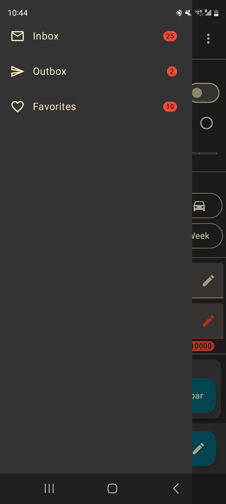 | 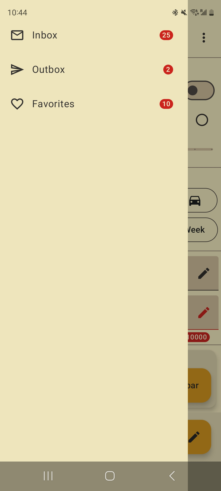 |
| 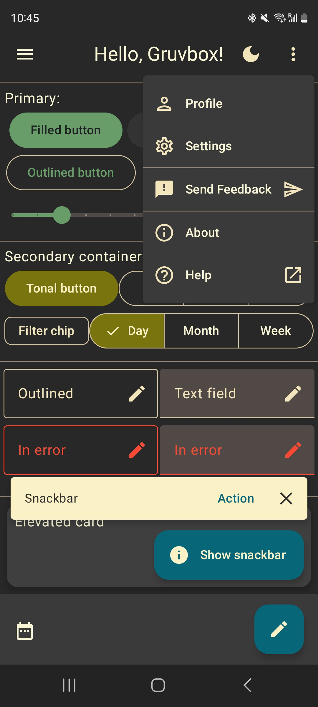 | 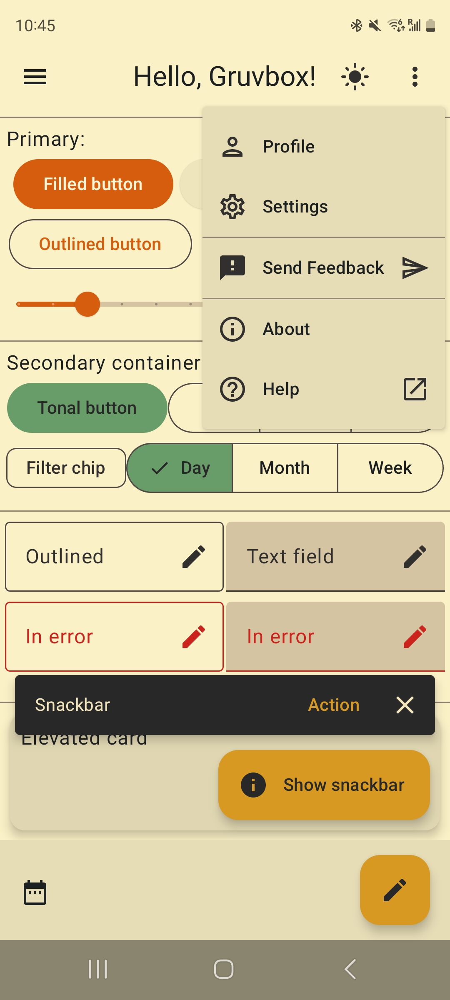 |
| 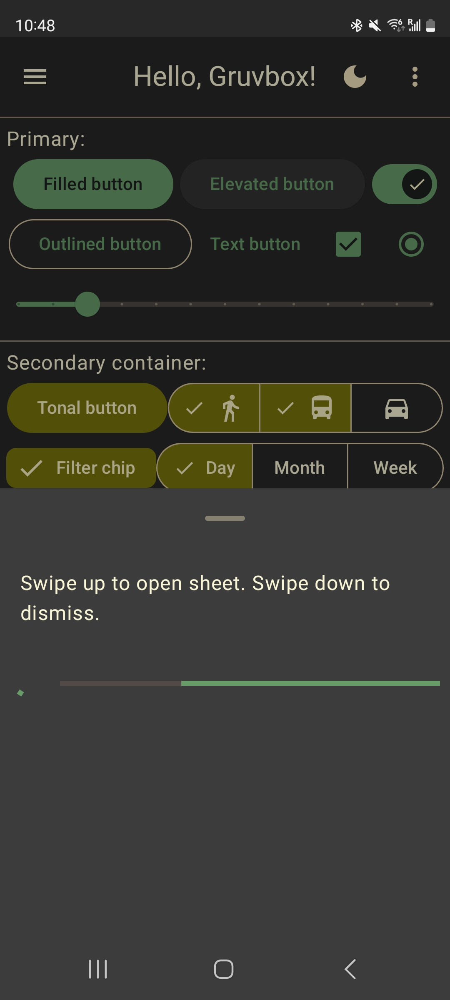 | 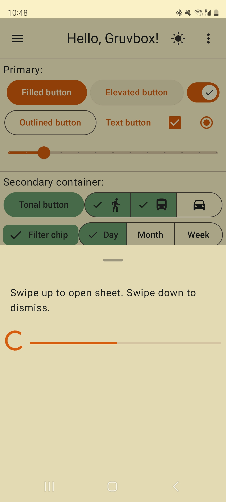 |
| 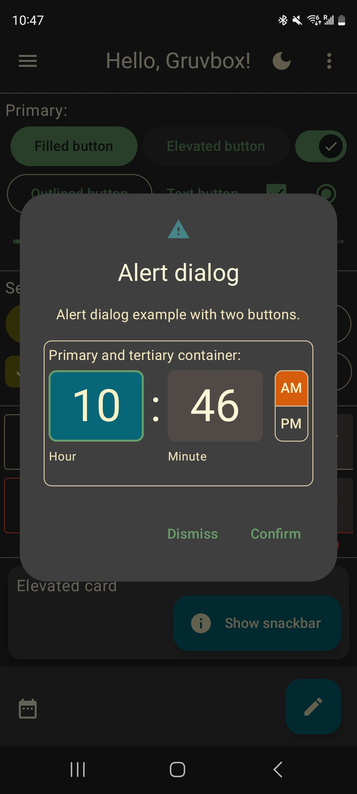 | 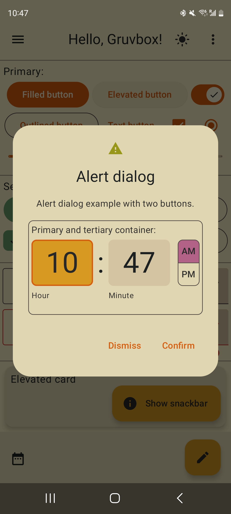 |
|  | 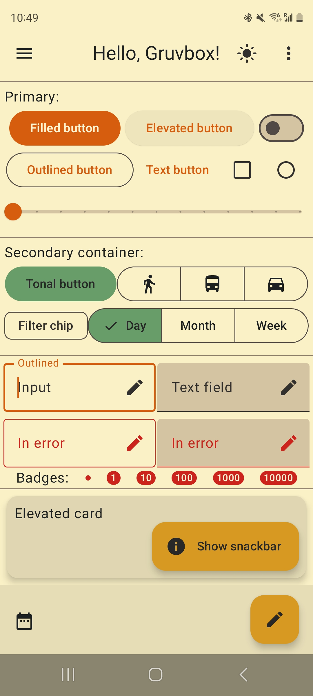 |
| 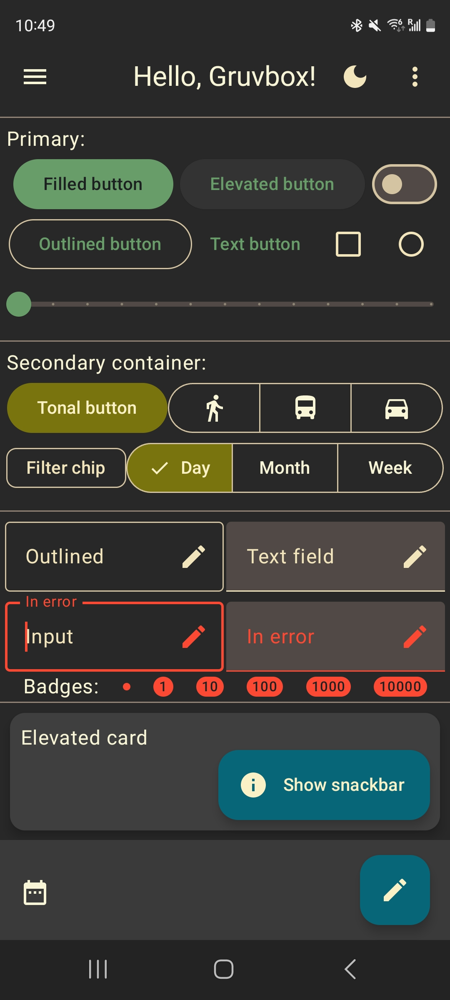 | 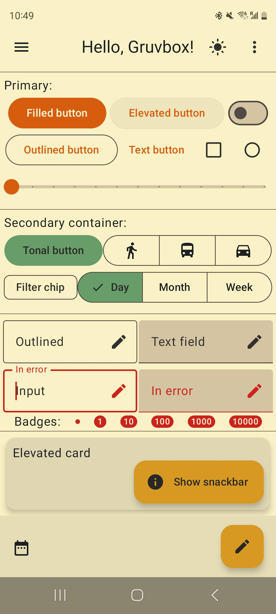 |
|  |  |
|  | 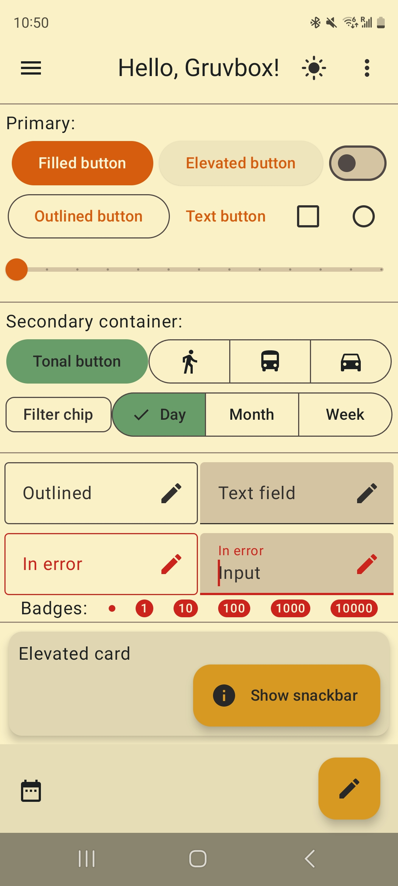 |
